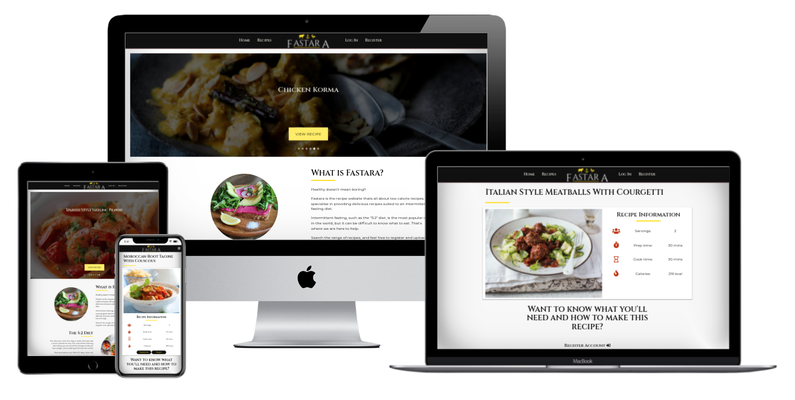
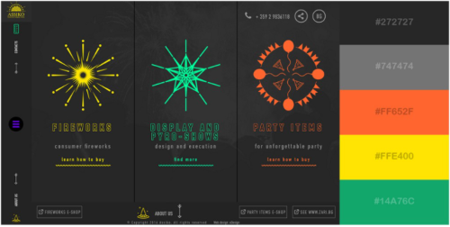
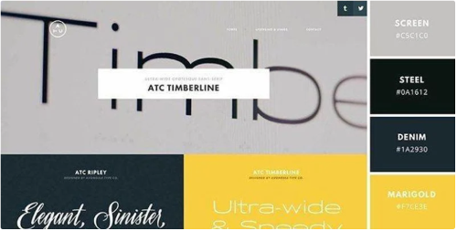
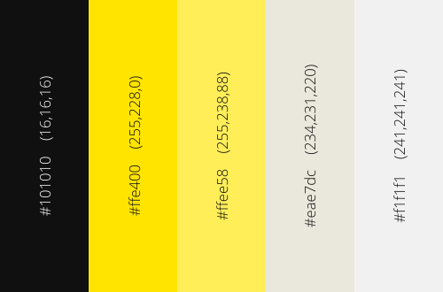
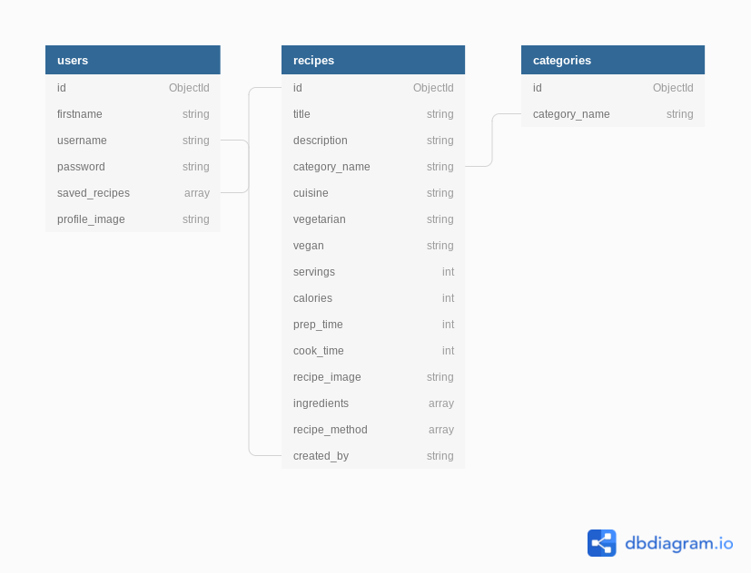

<h1 align="center">Fastara</h1>

View the repository in GitHub [here](https://github.com/Tawnygoody/Fastara)

View the live project [here](https://fastara.herokuapp.com/)

# Contents

1. [User Experience (UX)](#user-experience-(ux))
    - [Strategy](#strategy)
    - [Scope](#scope)
    - [Structure](#structure)
    - [Skeleton](#skeleton)
    - [Surface](#surface)
2. [Database Schema](#database-schema)
3. [Technologies Used](#technologies-used)
    - [Languages Used](#languages-used)
    - [Frameworks, Libraries & Programmes used](#frameworks-libraries-and-programmes-used)
4. [Testing](#testing)
5. [Database Creation](#database-creation)
6. [Deployment](#deployment)
    - [Forking the GitHub Repository](#forking-the-github-repository)
    - [Making a Local Clone](#making-a-local-clone)
    - [Heroku app](#heroku-app)
7. [Credits](#credits)
    - [Code](#code)
    - [Media](#media)
8. [Acknowledgments](#acknowledgments)

# User Experience (UX)

## Strategy

Healthy Doesn't Mean Boring!!

Fastara is a recipe website aimed at user's looking for low calorie recipes or who are on
or looking to explore an intermittent fasting diet such as "5:2" diet. Visitors are 
encouraged to upload and share their own creations with the community. 

### User Stories

- First Time Visitor Goals
    1. As a first time visitor, I want to understand the purpose of the site at first 
    glance, to establish whether I want to explore the site further. 
    2. As a first time visitor, I want to be able to see recipes, to establish whether
    I wish to register, to see full recipes. 
    3. As a first time visitor, I want to be able to click through different meal types
    at the touch of a button.
    4. As a first time visitor, I want to be able to register an account easily, without
    providing much personal information. 

- Returning Visitor Goals
    1. As a returning visitor, I want to be able to login into my account, without re-registering.
    2. As a returning visitor, I want to be able to logout out of my account. 
    3. As a returning visitor, I want to be able to view my profile. 
    4. As a returning visitor, I want to be able to delete my account should I wish. 
    5. As a returning visitor, I want to be able to save other user's recipes to my profile, 
    for easy viewing on future visits to the site. 
    6. As a returning visitor, I want to be able to remove saved recipe's from my profile should
    I no longer require them. 
    7. As a returning visitor, I want to to be able to access recipe information such as the ingedients 
    and method.

- Frequent User Goals
    1. As a frequent visitor, I want to be able to upload recipes to the website, and have access to 
    any recipes I have uploaded on my profile. 
    2. As a frequent visitor, I want to be able to edit and recipe I have created. 
    3. As a frequent visitor, I want to be able to delete any recipe I have created. 
    4. As a frequent visitor, I want to be able to search recipes containing certain 
    ingredients, or by a recipe name. 
    5. As a frequent visitor, I would like some information, showing which recipes contain 
    the least calories and which recipes take the least amount of time. 

- Admin Goals
    1. As an admin user, I need to ensure some access control, to allow me to edit and delete recipes 
    that are not deemed suitable for the website. 

## Scope

Fastara is centered around CRUD (Create, Read, Update Delete) functionality and interacts 
with a MongoDB Atlas cloud database managements system. This is the key feature to allow the 
app to function. 
- Create - Recipes can be saved to the database, using a form on the site. 
- Read - View all of the recipes saved in the database:
    - Recipes can be filtered by meal type. 
    - Search bar functionality allows the user to search for recipes using keywords. 
- Update - Users can edit their own recipes, which changes the stored content within the 
database (provided they are allowed to do so).
- Delete - Users can delete any recipes they have uploaded, or can delete their profile 
should they wish. 

To prevent unwanted editing or deletions, the website has been designed in a way that these 
functions are only available to the uploader of the specific recipe or to the admin user. 
Full CRUD functionality is only authorised to registered users. 

For any site user: 
- Home Page, with attractive imagery, and some information about the site. 
- Recipes Page, showing all the recipes that have been uploaded to the site. 
- Recipe Page, showing limited information about an individual recipe. 
- Login Page
- Register Page
- Information to contact company. 

For registered users:
- Log Out functionality. 
- Clear profile page displaying any recipes the user has uploaded or saved, and 
some basic user information. 
- Recipe Page, shows all information about an individual recipe. 
- Add a recipe page, allowing users to upload there own recipes. 
- Dashboard page, allowing users to allow users to compare recipes. 

For site admin: 
- CRUD functionality for all recipes, regardless of who uploaded them. 

## Structure

### Existing Features

- Base Page:
    - Navbar (Desktop) - The navbar has a centralised Fastara Logo. Links to the 
    pages are then aligned either side of the logo. I feel this gives the site a 
    contemporary feel, and works well having even number of links either side when 
    a user is either logged in or logged out. The dark background contrasts well with 
    the logo color. Links have been given an off-white color, as to not detract from
    the logo.
    - Navbar (Mobile) - A simple collapsible side nav replaces the links either side 
    of the logo when viewing the site on smaller screen sizes. This is triggered by the 
    hamburger icon, and has the the same dark background as the navbar. An additional logo
    can be seen at the top of the collapsible navbar. 
    - Flash Messages - Imported from Flask, the "flash" feature provides helpful user feedback
    after interaction with the site. 
    - Footer - Footer contains social media links and a github link which open in seperate
    tabs allowing the user to remain on Fastara. Email information for the company is also available
    should a user have any query. 

- Home Page: 
    - A carousel image display with autoplay featuring recipes which have been uploaded by admin. 
    Images are randomised and will show 6 recipes all of which have buttons to take them to that 
    recipe page. 
    - A section briefly explaining what Fastara offers, what intermittent fasting
    involves and its relevance to the site. These fade in on scrolling providing a nice
    user interaction to keep the user's attention. 
    - A book promotion section providing a deeper insight into intermittent fasting, which opens
    in a separate link. 
    - A category section displaying a few recipes for each of the different meal types, with links 
    to take the user to view more of the same category. These recipes are randonmised so the 
    same recipes do not appear on the home page every time it is refreshed/visited. The recipe cards 
    scale in on scroll, which is particularly satisfying on smaller devices. 
- Log In Page
    - A striking yet simple background image can be seen to keep the user interested. 
    - A simple dark background form, which is partially opaque, allows the background
    image to be seen whilst the content is still clearly visible. 
    - Fontawesome icons have been used to provide futher user engagement, with a large 
    login button. 
    - If a user does not already have an account, a link below the login button will take
    them to the register page. 
- Register Page
    - This has mostly the same features as the login page with some minor differences:
        - First name field rather than email or fullname, gives a informal tone, 
        - If a user already has an account, a link below the register button will take them 
        to the login page. 
- Recipes Page
    - At the top of the page there is a search bar, allowing the user to search for recipes using 
    keywords of their choice. This will filter results from the Recipe Title, Description & ingredients,
    and display only recipes matching that criteria. If no results are returned then a message stating
    No results found displays. The reset button allows the user to display a list of all the recipes. 
    - Filter buttons below the search bar allows the user to filter the recipes they see 
    by meal type. 
    - Recipe cards display an image of the recipe, which when hovered over, or clicked on smaller devices, 
    scale in and show an overlay with the name of the recipe. This is a subtle interaction to entice the user. 
    A calorie count a brief description is also provided on the cards. The orange eye allows the user to view
    the entire recipe. This has been tooltipped to provide helpful guidance to the user. 
    - When a user is logged in a tooltipped plus icon will be visible on the cards, which allows the user 
    to save the recipe to their profile. This icon does not appear when the recipe was uploaded by the session
    user as this will already appear on their profile under uploaded recipes. 
    - The recipe cards have been paginated so that only 6 results display per page, so a user does not need to 
    do large amounts of scrolling to get to the bottom / top of the page. 
- View Recipe Page (When not logged in / registered)
    - Below the title of the recipe is a card with an image of the recipe with some information 
    relating to the recipe (calories, cook time, prep time, servings and whether it is vegetarian/
    vegan). Image of the recipe is crucial - saying goes "people eat with their eyes" - this is definately
    relevant when coming to recipe websites. The images are styled so they do not stretch, and should 
    look appealing on all device sizes. 
    - Below the recipe card is section to encourage the user to register / log in. If the ingredients / methods
    fields were shown to an un-registered user, there may be no incentive for a user to register. Un-regisered users
    have the basic information they need to determine whether recipes appeal to them. 
    - At the bottom of the page is a button to take the user back to the recipes page. 
- View Recipe Page (When user is logged in)
    - Title and image card remain the same when the user is logged in. 
    - Below the recipe card, shows who created the recipe and shows the recipe description
    in italics, with a yellow background. This is to further engage the user. 
    - The ingredients and method columns are split unevenly, with the method column being wider 
    on larger devices, as this tends to have more content than the ingredients column. The dark 
    background of the ingredients column provides a nice contrast and clearly separates the 
    ingredients from the method. 
    - At the bottom of the page is a variety of buttons. Which buttons are shown varies according 
    to the user and which user uploaded the recipe:
        - A user who uploaded the recipe, will be shown a recipes button to take the user back to 
        the recipes page, an edit button to enable the user to edit the recipe and a delete button 
        to allow the user to delete the recipe if they wish. The delete button triggers a modal to
        confirm the user wishes to delete the recipe, to reduce the chance of unwanted deletions. 
        - A user who did not upload the recipe will be shown the recipes button to take the user back 
        to the recipes page and a save button to save the recipe to their profile. 
        - The admin user will be shown, the recipe button, edit button, and delete button, as this user 
        has authority to edit and delete any recipe. The save button will only show on recipes not 
        uploaded by admin. 
- Profile Page
    - The profile page will only be displayed to users that are logged in. 
    - The card at the top of the page is similar in appearance to the card on the view recipes page, with the 
    main difference in appearance that the profile image is a smaller on larger devices. Profile information 
    such as username, recipes created and recipes saved can be viewed here. Below this the user can choose to
    edit their profile image, log out, and delete their profile. The log out button and delete profile 
    buttons will trigger modals, to reduce the chance of unwanted deletion / logging out. 
    - When a user has not uploaded any recipes an upload recipe button will be shown to encourage the user
    to upload their own recipes. 
    - When a user has uploaded there own recipes, the upload recipe button will be removed, and the recipe card
    will be displayed here. These will appear as they do on the recipes page. Again the plus icon will not show 
    as the recipe has been uploaded by the user and already appears on the users profile, therefore there is no 
    requirement to save the recipe to their profile. 
    - If a user has saved no recipes to there profile then no section will display below the created recipes section. 
    Once a user has saved a recipe, the saved recipes title will show, with the recipe cards shown in this section. 
    Next to the eye icon to view the recipe, a tooltipped minus icon will display should the user wish to remove the 
    recipe from the saved recipes section. 
- Dashboard 
    - By utilising MongoDB Charts this provides a visualization of the data stored in MongoDB. This can provide, useful
    information to the user and actionable insight. 
    - Whilst I could choose to do a whole variety of charts, this could be deemed tedious to a user. I have therefore chosen 
    4 charts which provides the most relevant information to the user: 
        - A heat map showing where the recipes come from around the globe. 
        - A chart showing which user has uploaded the most recipes. 
        - A chart showing which recipes take the least amount of time to prep and cook. 
        - A chart showing which recipes have the lowest amount of calories. 
    - The first 2 charts are just for the general interest of the user. The second 2 charts 
    provide the user with actionable insight. Most people after a full days work want dinner to 
    be full of flavour and take the least amount of time. The chart showing recipes with the least 
    calories is especially helpful to users who are on an intermittent fasting diet plan, as they have 
    a restrictive amount of calories they can consume on fast days. 
    - Charts are set to refresh every 30mins. 
- Add Recipe Page
    - The same background image as the log in page and register page has been used. 
    - There are various fields for the use to fill in. Relevant fields have been tooltipped 
    to provide users with the requirements they need in order to create the recipe. A dropdown 
    field has been used to select the recipe category, and switches have been used to indicate 
    whether a recipe is vegan or vegetarian. 
    - Ingredients and method fields have an add ingredient/method button, allowing the user to 
    seperate each ingredient / method. When each new step is added, a red bin appears allowing the user 
    to delete an ingredient / method. 
    - The add recipe button at the bottom will add the recipe to the database and display the recipe 
    card on recipes and the users profile. Only when the required fields have been completed, and meet the 
    stated criteria will this be achievable. 
- Edit Recipe Page 
    - The edit recipe page can be accessed from the "View Recipe" page, which are available on the recipes 
    page and the users profile page. 
    - The edit recipe is much the same as the add recipe page, however the page is pre-populated 
    with the recipe data. 
    - At the bottom of the page there is cancel button which will cancel any changes made and take the user 
    back to the recipes page and an edit button which update the changes in the database and take the user 
    back to the recipes page. 

### Future Features

- An option for a user to build a meal plan for a day. For those who are on the 5:2 diet plan, 
as they have a limited number of calories for the day, it would be useful to the user, to be able 
to build a meal plan, that keeps all the 3 meal types (Breakfast, Lunch & Dinner) under their 
daily allowance. 
- A feature I would like the implement in the future would be a sort function, so that the user 
could sort all recipes by calorie count for example. I have included charts on the dashboard to illustrate 
recipes with the lowest calorie count and quickest cook time, however a dropdown to sort recipes would 
be more beneficial to the user. 
- I would like some form of image URL validation, so that not just any URL can be inputted into the 
edit profile picture, and recipe image fields, and would remove the need for "onerror" image URL. 
- I would like to be able to upload images from a file rather than an image URL. For the purposes of this project 
I am happy to accept image uploads from a URL. 

## Skeleton 

Below you can find links for my wireframes, showing how I would like the pages to be strcutured, 
and how the site would appear on different device sizes. 

### Wireframes 

The wireframes have been created using Balsamiq, and show for desktop, iPad and iPhone. 

- Home Page
    - [Desktop](documentation/wireframes/home-desktop.png)
    - [iPad](documentation/wireframes/home-ipad.png)
    - [iPhone](documentation/wireframes/home-iphone.png)
- Recipes Page
    - [Desktop](documentation/wireframes/recipes-desktop.png)
    - [iPad](documentation/wireframes/recipes-ipad.png)
    - [iPhone](documentation/wireframes/recipes-iphone.png)
- Log In Page
    - [Desktop](documentation/wireframes/login-desktop.png)
    - [iPad](documentation/wireframes/login-ipad.png)
    - [iPhone](documentation/wireframes/login-iphone.png)
- Register Page
    - [Desktop](documentation/wireframes/register-desktop.png)
    - [iPad](documentation/wireframes/register-ipad.png)
    - [iPhone](documentation/wireframes/register-iphone.png)
- Profile Page 
    - [Desktop](documentation/wireframes/profile-desktop.png)
    - [iPad](documentation/wireframes/profile-ipad.png)
    - [iPhone](documentation/wireframes/profile-iphone.png)
- Add / Edit Recipe 
    - [Desktop](documentation/wireframes/add-desktop.png)
    - [iPad](documentation/wireframes/add-ipad.png)
    - [iPhone](documentation/wireframes/add-iphone.png)
- View Recipe Page 
    - [Desktop]()
    - [iPad]()
    - [iPhone]()
- Dashboard Page 
    - [Desktop]()
    - [iPad]()
    - [iPhone]()

## Surface 

### Design 

#### Colour Scheme 

- I have taken inspiration from [Canva's](https://www.canva.com/learn/website-color-schemes/)
professional and modern colour scheme and [Assiko's Fireworks](https://www.awwwards.com/sites/assiko), described
by [Visme](https://visme.co/blog/website-color-schemes/) as Innovative and audacious, seen below. Both 
color schemes have dark greys, yellows, and lighter grays which were the main colorsI have chosen to include 
in my site. 

##### Assiko Colour Scheme

##### Canva Professional & Modern Colour scheme

##### Chosen Colour scheme

- Very dark Grey (#101010) has been used for the navbar and the footer, and dark text.     
- Bright Yellow (#ffe400) has been used for headings underlines, in the logo, and to provide 
text contrast against dark buttons / links. 
- Ligher yellow (#ffee58), has been used to highlight nav links, and on buttons to take the user 
to different pages on the site. 
- Very light grey (#eae7dc) has been used for the nav links, so they do not detract from the Logo 
text, as this is White, and light text on dark backgrounds.
- Off white (#f1f1f1) has been used for overlay text to provide more contrast with the images behind 
than the very light grey would offer. 

- Additional colors have been used to signify, saving recipes, editing recipes, and any deletion's/
Log out. 

#### Typography 

- Typography is just as crucial design aspect as other design aspects. I wanted the main 
font to be elegant, such that you would find on a high end restaurant website. I wanted to steer 
clear of script fonts, which are sometimes considered elegant, however can reduce readability. 

    - After playing around on Canva designing the logo, and experimenting with different fonts, I 
    settled on "Cinzel" as the main font. I like that the font works with capital letters, which is 
    ideal for titles, headings and subheadings. The font also feels contemporary which is 
    in-keeping with the websites colour scheme. 

    

    - "Montserrat" was recommended as a good pair for "Cinzel" on [Google Fonts](https://fonts.google.com/).
    I have used this font for the page content, which has solid readability and is in-keeping with the 
    theme of the website. 

    

#### Imagery 

The majority of the imagery for the site comes from the recipe uploads. I have chosen 
2 stock photos for the home page which show clean, colourful, healthy food in keeping 
with the theme of the site. 

On the Log In, Register, Add Recipe and Edit Recipe pages, I have used a subtle healthy 
food related image. This is a a nice aesthetic making the page more interesting, whilst not 
distracting from the main purpose of each of the pages. 

# Database Schema 

Fastara used MongoDB Atlas to store and retrieve all of the user input data. 
The schema for Fastara is straightforward and can be seen in the illustration
below.

The collection contains 3 collections which in turn hold multiple documents:

- Users: This collection stores the user data. When the user registers, the firstname, username 
and password are populated from the register form. An empty saved recipes array is created, which is 
populated with individual recipe id's when a user save's recipes to their profile. The profile_image is 
set with a default image. When the user is logged in they can choose to edit this image and upload their 
own image URL. 

- Recipes: The recipes collection contains the largest documents in the database. With the exception of the 
created_by field all fields are populated by the user on the Add Recipe form. After researching 
other recipe sites I have selected fields which I deem necessary to provide the user with the 
essential information they require in order to make each recipe. Recipe ingredients and method are formatted 
into an array using "request.form.getlist". This can then be looped through using Jinja templating to display 
each ingredient / method to the user. 

- Categories: The categories collection contains small documents for each meal type 
(category_name), in this case Breakfast, Lunch & Dinner, and allows the user to select 
which category the recipe falls under. 

# Technologies used

## Languages Used 

- [HTML](https://en.wikipedia.org/wiki/HTML5)
- [CSS](https://en.wikipedia.org/wiki/Cascading_Style_Sheets) 
- [JavaScript](https://en.wikipedia.org/wiki/JavaScript)
- [Python](https://www.python.org/)

## Libraries & Integrations 

- [Flask](https://flask.palletsprojects.com/en/2.0.x/)
    - Used as a Python micro web framework and relies on jinja.
- [Jinja](https://jinja.palletsprojects.com/en/3.0.x/)
    - Used as a templating engine to render the document. 
- [Materialize CSS](https://materializecss.com/)
    - Used as a framework for styling and to make the website responsive. 
- [Fontawesome](https://fontawesome.com/)
    - Fontawesome has been used for icons across the website.
- [AOS](https://michalsnik.github.io/aos/)
    - Animate on Scroll library has been used on the home page to aid with user interaction. 
- [Google Fonts](https://fonts.google.com/)
    - Google Fonts has been used to import "Cinzel" & "Montserrat" fonts used across the website. 
- [jQuery](https://jquery.com/)
    - Has been used to ease DOM manipulation. 

## Database system

- [MongoDB Atlas](https://www.mongodb.com/)
    - NoSQL database to store recipe, category and user information.
- [MongoDB Charts](https://www.mongodb.com/)
    - Used to create charts for the websites dashboard.

## Other Programmes
- [Github](https://github.com/)
    - GitHub is used to store the project code after being pushed from Git.
- [Git](https://git-scm.com/) 
    - Git was used for version control by utilizing the Gitpod terminal to commit to Git and Push to GitHub.
- [Heroku](https://id.heroku.com/login)
    - This has been used to deploy the live website.
- [Balsamiq](https://balsamiq.com/)
    - This has been used to create the wireframes for the project. 
- [Canva](https://www.canva.com/)
    - Canva has been used to design the websites logo.
- [Dbdiagram](https://dbdiagram.io/home) 
    - Used to create the database schema illustration.
- [Google Developer Tools](https://developers.google.com/web/tools)
    - Google developer tools have been used to fix bugs, and test responsiveness and website performance. 

# Testing 

All testing carried out on the website can be found in the following file: 

## [TESTING.md](TESTING.md)

# Database Creation

Fastara is connected to a MongoDB database in the cloud. The following steps were used to create the database. 

1. Log in or create an account with [MongoDB](https://mongodb.com)
2. Create a new shared cluster (if using free cluster)
3. Select a Cloud provider. Amazon Web Services (AWS) is a recommended service. 
4. Select a region (whichever region is closest).
5. Select Cluster Tier (M0 Sandbox selected for the purposes of this project). 
6. Add a Cluster Name. 
7. Click "Create Cluster" button. 
8. Click on the "Database Access" in order to create the database user credentials. 
9. Click "Add New Database User". 
10. Set up a "username" & "password" and ensure User Privileges are set to "Read and write to any database". 
11. Click "Add User" button. 
12. Click on "Network Access" in order to whitelist our IP address and make sure it has access to the database.
13. Click "Add IP Address"
14. For the purposes of this project select "Allow access from anywhere". (Not recommended for full production apps). 
15. Click on "Clusters" followed by the "Collections" button. 
16. Click "Add my own data" button, and add a "Database Name" and "Collection Name". 
17. Clicking "Create" will create the database with a collection inside that database. 

# Deployment

## Forking the GitHub Repository: 

By forking the GitHub Repository to make a copy of the original repository, we can make changes without it affecting the original repository, by following these steps: 

1. Log into GitHub and locate the [repository](https://github.com/Tawnygoody/Fastara) you wish to fork. 
2. At the top-right of the repository underneath the navbar, click the "Fork" button. 
3. You should now have a copy of the original repository in your account. 

## Making a Local Clone

1. Log into GitHub and locate the [repository](https://github.com/Tawnygoody/Fastara) you wish to clone. 
2. Click the dropdown labelled "Code" to the left of the green "Gitpod" button and copy the link shown. 
3. Open Git Bash. 
4. Change to the location where you want the cloned directory to be made. 
5. Type "gitclone" and then paste the URL you coped in step 2. 

## Heroku App

1. Log in or sign up to [Heroku](https://heroku.com).
2. From the Heroku Dashboard click "Create New App" button.
3. Give the app a name (this must be unique and Heroku will let you know if this available)
4. Set the most appropriate region and click "Create App", which will take the user to the "App Dashboard".
5. Within our project, to install Heroku type: "npm install -g heroku" in the terminal. 
We then need to tell Heroku which applications an dependencies are required to run the app. 
6. Enter the following into the terminal: "pip3 freeze --local > requirements.txt". 
The Procfile is what Heroku looks for to know which file runs the app, and how to run it. 
7. Enter the following into the terminal: "echo web: python app.py > Procfile". 
8. Set up automatic deployment by clicking the deploy tab and lciking GitHub as the deployment method. 
9. Ensure your GitHub profile is displayed, then add the name of the repository, and click search. 
10. Click "Connect" to the correct repository. 
11. Click the "Settings" tab and then click "Reveal Config Vars". 
12. Here we can securely tell Heroku which variable are required. These can be found in the "env.py" file, and are as follows: 

| Key | Value |
| :----: | :----: |
| IP | 0.0.0.0 |
| PORT | 5000 |
| SECRET_KEY | Randomly Generated from [RandomKeygen](https://randomkeygen.com/) |
| MONGO_URI | Unique MongoDB URI |
| MONGO_DBNAME | Unique MongoDB Database Name |

13. To get the MONGO_URI, on MongoDB click the "Overview" tab followed by the "Connect" button. 
- Select "Connect Your Application"
- Ensure "Python" is selected for the "Driver" and choose the appropriate version. 
- Copy the connection string and substitute in your own database name and password in the angle brackets placeholder.
14. Click the "Deploy" tab and "Enable Automatic Deployment"

# Credits

## Code 

|  #  |  Source  |  Description  |
|:---:|---------| ---------------- |
| 01 | [Code Institute Task Manager App](https://codeinstitute.net/) | Code institutes task manager app provided the building blocks for Fastara |
| 02 | [Mozillazg](https://gist.github.com/mozillazg/69fb40067ae6d80386e10e105e6803c9) | Aided with setting up flask paginate |
| 03 | [Smoodydev](https://github.com/smoodydev/flaskpaginate) | Further aided flask paginate and helped reduce the number of items per page |
| 04 | [Flask Documentation](https://flask.palletsprojects.com/en/1.1.x/patterns/errorpages/) | Helped with setting up the error pages | 
| 05 | [Stack Overflow](https://stackoverflow.com/questions/36581504/materialize-carousel-slider-autoplay) | Code to allow the home page carousel to autoplay, so that recipes slide to the next after 5 seconds |
| 06 | [Stack Overflow](https://stackoverflow.com/questions/35786433/how-to-listen-on-select-change-events-in-materialize-css) | Helped with listening to onchange events for materialize dropdown validation | 
| 07 | [Stack Overflow](https://stackoverflow.com/questions/15975586/jquery-change-href-when-image-slider-changes) | Helped change the links for the recipes in the carousel on the home page, to redirect the user to the correct page |
| 08 | [Stack Overflow](https://stackoverflow.com/questions/52850091/materialize-select-and-dropdown-touch-event-selecting-wrong-item) | Code to prevent materialize select from selecting the wrong item on touchscreen devices | 
| 09 | [Stack Overflow](https://stackoverflow.com/questions/46012482/unwanted-white-space-on-right-side-in-mobile-view) | Code to prevent white space on home screen when scrolling sideways on mobile devices |
| 10 | [W3Bits](https://w3bits.com/css-image-hover-zoom/) | Aided with zooming in on card images on hover. |
| 11 | [W3Schools](https://www.w3schools.com/howto/howto_css_image_overlay_title.asp) | Aided with displaying the card image overlay for the recipe title. |
| 12 | [w3schools](https://www.w3schools.com/howto/howto_css_bullet_color.asp) | Code to change the colour of the bullet points for the ingredients list. |

## Media 
|  Image  |  Source  |
|:------:|---------|
| Home Page Circular Image 1 | [Unsplash](https://unsplash.com/photos/V9LP6-y8e5w) |
| Home Page Circular Image 2 | [Unsplash](https://unsplash.com/photos/KPDbRyFOTnE) |
| Default Profile Image | [Unsplash](https://unsplash.com/photos/IGfIGP5ONV0) |
| Background Image | [Unsplash](https://unsplash.com/photos/08bOYnH_r_E) |
| Home Page Book | [Snazel](https://www.snazal.com/uk-buy-online-the-fast-diet-revised-and-updated--lose-weight-sta--DEALMAN-U46-FastDietRU-2375.html?gclid=Cj0KCQjwkZiFBhD9ARIsAGxFX8DqCjrf5QQe6azv8UJr4i2W2AJCoU1AZkQTIx870bRp4j8lx2_elIMaAs-3EALw_wcB) |

