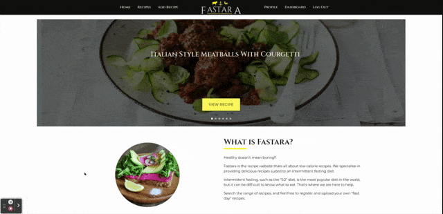
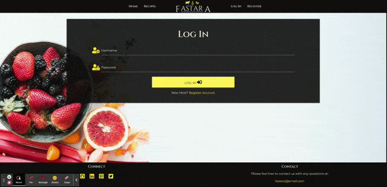
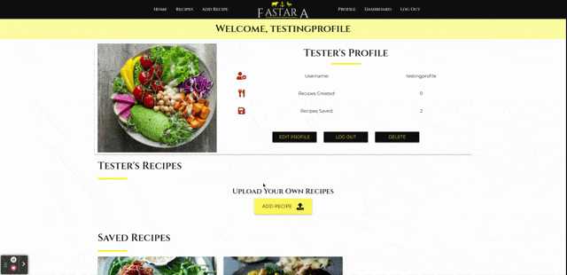
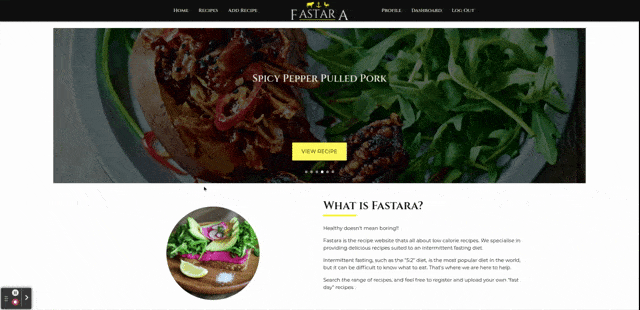
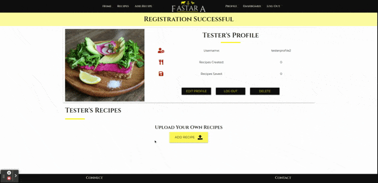
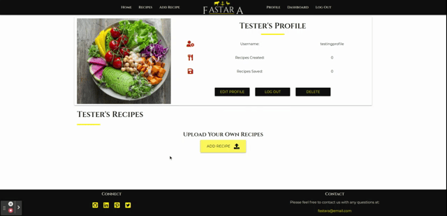
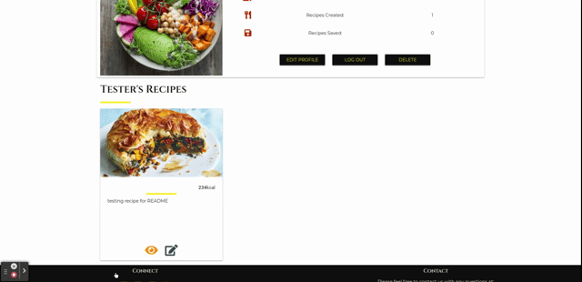
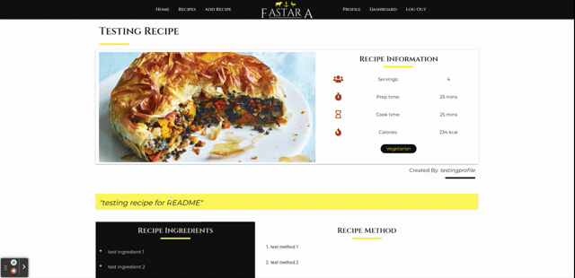
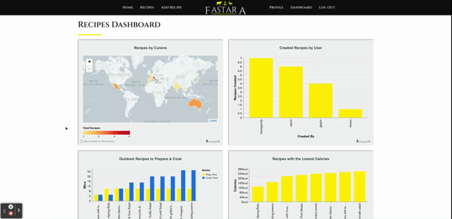

# Testing

# Contents
1. [Testing User Stories](testing-user-stories)
    - [First Time User](first-time-user)
    - [Returning User](returning-user)
    - [Frequent User](frequent-user)
    - [Admin Goals](admin-goals)
2. [Code Validation](code-validation)
3. [Browser Compatibility](browser-compatibility)
4. [Functionality Testing](funcitonality-testing)
    - [Navigation](navigation)
    - [Home Page](home-page)
    - [Registration & Log In](registration-and-log-in)
    - [Adding A Recipe](adding-a-recipe)
    - [Editing A Recipe](editing-a-recipe)
    - [Deleting A Recipe](deleting-a-recipe)
    - [User Profile](user-profile)
    - [Save Recipe to Profile](save-recipe-to-profile)
    - [Recipes Search & View](recipes-search-and-view)
    - [Recipe Page](recipe-page)
    - [Dashboard](dashboard)
5. [Responsive Design](responsive-design)
6. [Security Testing](security-testing)
7. [Solved Bugs](solved-bugs)
8. [Known Issues](known-issues)
9. [Lighthouse](lighthouse)

# Testing User Stories

## First Time User

1. As a first time visitor, I want to understand the purpose of the site at first 
glance, to establish whether I want to explore the site further.
    - The user is greeted with a carousel of image showing recipes with a view recipe 
    button clearly indicating this is some form of recipe website. 
    - Below the carousel is a brief introduction explaining what Fastara is and offers. I 
    have kept this introduction relatively short so the user does not lose interest. 

    

2. As a first time visitor, I want to be able to see recipes, to establish whether
I wish to register, to see full recipes. 
    - On the home page the user can see a carousel of recipes which autoplay, and further down 
    the page can see recipes from the different categories (breakfast, lunch and dinner). 
    - Before a user is registered / logged in, they can view all recipes on the recipes page. 
    - Before a user is registered / logged in, they can view individual recipes, which shows 
    some limited recipe information and an image of the recipe. 

    

3. As a first time visitor, I want to be able to click through different meal types
at the touch of a button.
    - On the home page, the user can view a few recipes from each category, and click 
    the link to take the user to view more recipes of the same category. 
    - On the recipes page, the user can click one of the category filter buttons to show them 
    all the recipes in that category. 

    

4. As a first time visitor, I want to be able to register an account easily, without
providing much personal information.
    - User's can register via the register link in the navbar, where they are taken to a 
    register form, and asked for firstname, username, and password. 

    

## Returning User 

1. As a returning visitor, I want to be able to login into my account, without re-registering.
    - A separate Log In link in the navbar allows the user to login into their account with their 
    username and password. 
    - If a user clicks on the register link they can see a message below the register button - 
    "Already Registered? Log In", with a link to take the user to the log in page. 

    

2. As a returning visitor, I want to be able to logout out of my account. 
    - When a user is logged in, a log out link in the navbar will open a modal confirming 
    whether the user wishes to log out of their account. 
    - A user can also log out from their profile, which will open the same modal confirming 
    whether the user wishes to log out of their account. 

    

3. As a returning visitor, I want to be able to view my profile. 
    - When a user logs in they are automatically redirected to their profile page, and 
    a welcome flash message greets the user.  
    - A profile link in the navbar allows the user to return to their profile from any page, once
    they are logged in. 

    

4. As a returning visitor, I want to be able to delete my account should I wish. 
    - From a user's profile page, the user can click the delete button, which will open a 
    modal confirming whether the user wishes to delete their account or not. A message is left 
    to confirm that any recipes the user has uploaded will not be removed from the site. 

    

5. As a returning visitor, I want to be able to save other user's recipes to my profile, 
for easy viewing on future visits to the site. 
    - Any recipe that is not uploaded by the current session user, will display a plus icon on 
    the recipe card, which allows the user to save the recipe to their profile. This will then 
    display on the user's profile, under any recipes that have been uploaded by the session user. 
    - When a user views an individual recipe that has not been uploaded by the session user, 
    a save recipe button will show at the bottom of the recipe allowing the user to save the recipe 
    to their profile.

     

6. As a returning visitor, I want to be able to remove saved recipe's from my profile should
I no longer require them. 
    - When a user views the recipe cards in the saved recipes section on their profile, a 
    minus icon shows, which is tooltipped informing the user that this will remove the recipe 
    from their profile. A flash message displays indicating the recipe has been removed from their 
    profile. 

    

7. As a returning visitor, I want to to be able to access recipe information such as the ingedients 
and method.
    - Once a user has registered and logged in, when viewing individual recipes, rather than 
    a message asking whether they wish to log in or register to view the full recipe, the ingredients 
    and method are shown in two clear setions to the user, so they have all the information they need 
    to make the recipe. 

    

## Frequent User

1. As a frequent visitor, I want to be able to upload recipes to the website, and have access to 
any recipes I have uploaded on my profile. 
    - When a user is yet to upload any of their own recipes, a button on their profile will show 
    encouraging the user to upload their own recipes. 
    - A user can upload their own recipes using the add recipe link in the navbar, which will take 
    the user to a straightforward pre-defined form to fill in. 

    

2. As a frequent visitor, I want to be able to edit and recipe I have created. 
    - When viewing uploaded recipes on a user's profile then an edit icon will show on the recipe card, 
    which takes the user to the edit recipe form. This is pre-populated with all the recipe data, and is the same 
    format as the add recipe form. 
    - When viewing individual recipes, if the recipe has been uploaded by the user, then an edit 
    recipe button will show at the bottom of the page, which will take the user to the same 
    edit recipe form. 

    

3. As a frequent visitor, I want to be able to delete any recipe I have created.
    - When a user views a recipe that they have created a delete button will show at the bottom 
    of the recipe. This will trigger a modal to confirm whether they wish to delete the recipe or not. 
    - Note: A delete icon could have been added to the recipe card, but I decided against this, as I 
    feel this would have made the recipe cards to cluttered. 

    

4. As a frequent visitor, I want to be able to search recipes containing certain 
ingredients, or by a recipe name. 
    - On the recipes page there is a search function available to the user. Recipes will return 
    providing what the user searches for matches words in the Recipe Title, Description, or Ingredients. 

    

5. As a frequent visitor, I would like some information, showing which recipes contain 
the least calories and which recipes take the least amount of time. 
    - When a user is logged in a dashboard link is available in the navbar. The charts here 
    show the user which recipes have the lowest caloies, and which recipes are the quickest to 
    prepare and cook. 

    

## Admin Goals

1. As an admin user, I need to ensure some access control, to allow me to edit and delete recipes 
that are not deemed suitable for the website. 
    - When the user's username is "admin", then at the bottom of every recipe, the edit 
    and delete buttons will show. This is achieved using Jinja templating, and as there 
    can only be one "admin" username, this means only the admin user has access to this. 

    

# Code Validation 

|  Test  | Programme | Result |  Noting Points  | 
|-----| ------ | -------| ------------ |
| style.css | [W3C CSS Validator](https://jigsaw.w3.org/css-validator/) | No errors: [View](documentation/testing/code-validation/css.png) | Warning message with regards to unknown vendor extension (-o-, -webkit-, -ms-) |
| base.html | [W3C Markup Validator](https://validator.w3.org/) |  |  |
| home.html | [W3C Markup Validator](https://validator.w3.org/) |  |  |
| recipes.html | [W3C Markup Validator](https://validator.w3.org/) |  |  |
| login.html | [W3C Markup Validator](https://validator.w3.org/) |  |  |
| register.html | [W3C Markup Validator](https://validator.w3.org/) |  |  |
| profile.html | [W3C Markup Validator](https://validator.w3.org/) |  |  |
| dashboard.html | [W3C Markup Validator](https://validator.w3.org/) |  |  |
| add_recipe.html | [W3C Markup Validator](https://validator.w3.org/) |  |  |
| edit_recipe.html | [W3C Markup Validator](https://validator.w3.org/) |  |  |
| search.html | [W3C Markup Validator](https://validator.w3.org/) |  |  |
| view_recipe.html | [W3C Markup Validator](https://validator.w3.org/) |  |  |
| 404.html | [W3C Markup Validator](https://validator.w3.org/) |  |  |
| 500.html | [W3C Markup Validator](https://validator.w3.org/) |  |  |
| script.js | [JSHint](https://jshint.com/) | No errors: [View](documentation/testing/code-validation/js.png) |  |
| app.py | [PEP8 online](http://pep8online.com/) | No errors: [View](documentation/testing/code-validation/app.png) | N/A |

# Browser Compatibility

LambdaTest has been used to test the website across different browsers:

### Laptop / Desktop

The website has been developed on Google Chrome so browser testing has been compared against Google Chrome. 

|  Page  |  Safari 12 |  Firefox 86  |  Opera 74  |
|:---:|------------| ------------ |:------------:|
| Home | No difference | No difference | No difference | 
| Recipes | Whilst testing safari didnt seem to be picking up some of the recipe image and the default image was displayed - [View](documentation/testing/browser/recipe-image.png). Safari has been manually tested on iPhone / iPad and there is no issue here | No difference | No difference |
| Log In | No difference | No difference | No difference |
| Resgiter | No difference | No difference | No difference |
| Profile | No difference | No difference | No difference |
| Dashboard | No difference | No difference | No difference |
| Individual Recipe | No difference | No difference | No difference |
| Add Recipe | Slight difference in the appearance of the number selectors -[View](documentation/testing/browser/dropdown-safari.png) | Slight difference in the appearance of the number selectors -[View](documentation/testing/browser/dropdown.png) | No difference |
| Edit Recipe | Same difference as add recipe | Same difference as add recipe | No difference |

### iPhone 8

- Google Chrome - No issues
- Safari - No issues

## iPad 8th Generation

- Google Chrome - No issues
- Safari - No issues

# Functionality Testing

Functionality testing has been carried out on all browsers listed in the browser 
compatibility section. 

## Navigation 

|  Test  |  Purpose  |  Expected Result  |  Example  |
|:---:|-----------------| ---------------- |:-----:|
| 01 | Home link in navbar | Takes the user to the home page | N/A |
| 02 | Logo in navbar | When clicked takes the user to the home page| N/A |
| 03 | Recipes link in navbar | Takes user to the recipes page | N/A |
| 04 | Log In link in navbar | Takes user to the log in page form | N/A |
| 05 | Register link in navbar | Takes user to the register page form | N/A |
| 06 | Add Recipe link in navbar (when user logged in) | Takes user to the add recipe page form | N/A |
| 07 | Profile link in navbar (when user logged in) | Takes user to their profile page | N/A |
| 08 | Dashboard link in navbar (when user logged in) | Takes user to the dashboard page | N/A |
| 09 | Log out link in navbar (when user logged in) | Opens a modal confirming whether the user wishes to log out - confirming logs user out, and redirects them to the login page  | [View](documentation/testing/functionality/navigation/logout.png) |
| 10 | GitHub icon in footer | Opens github repository in a new tab | N/A |
| 11 | LinkedIn icon in footer | Opens developers linkedIn pafe in a new tab | N/A |
| 12 | Pinterest icon in footer | Open pinterest in a new tab | N/A |
| 13 | Twitter icon in footer | Opens twitter in a new tab | N/A |

## Home Page

|  Test  |  Purpose  |  Expected Result  |  Example  |
|:---:|-----------------| ---------------- |:-----:|
| 01 | Carousel Autoplay | Carousel should display six random recipes uploaded by admin and should automatically move to the next recipe after five seconds | [View](documentation/testing/functionality/home/autoplayc.gif) |
| 02 | Carousel Recipe link | View recipe button takes the user to the recipe page of the image shown | [View](documentation/testing/functionality/home/recipe-buttonc.gif) |
| 03 | Animations on scroll | When a user scrolls down a page different sections fade in / flip up | [View](documentation/testing/functionality/home/aosc.gif) |
| 04 | Find out more button | The find out more button opens a link in a seperate tab, offering the user the option to purchase the book feature | N/A |
| 05 | More Breakfast Button | Takes the user to the recipes page and filters the recipes for breakfast recipes | [View](documentation/testing/functionality/home/breakfastc.gif) |
| 06 | More Lunch Button | Takes the user to the recipes page and filters the recipes for lunch recipes | [View](documentation/testing/functionality/home/lunchc.gif) |
| 07 | More Dinner Button | Takes the user to the recipes page and filters the recipes for dinner recipes | [View](documentation/testing/functionality/home/dinnerc.gif) |
| 08 | Recipe Cards | Clicking the recipe image or the eye icon takes the user to that recipe page | [View](documentation/testing/functionality/home/viewc.gif) |
| 09 | Recipe Cards (when logged in) | Clicking the plus icon (when not uploaded by the session user) saves the recipe to their profile | [View](documentation/testing/functionality/home/savec.gif) |

## Registration and Log In 

|  Test  |  Purpose  |  Expected Result  |  Example  |
|:---:|-----------------| ---------------- |:-----:|
| 01 | Log In link | Yellow log in link under the register button redirects the user to the log in page | [View](documentation/testing/functionality/login-register/login-linkc.gif) |
| 02 | Register link | Yellow register link under the Log In button redirects the user to the registration page | [View](documentation/testing/functionality/login-register/register-linkc.gif) |
| 03 | First Name validation | First name (a-z, A-Z, between 2-20 characters). Input field tooltipped to provide user feedback. If invalid input turns red and feedback provided | [View](documentation/testing/functionality/login-register/firstnamec.gif) |
| 04 | User Name validation | User name (a-z, A-Z, 0-9 between 5-20 characters). Input field tooltipped to provide user feedback. If invalid input turns red and feedback provided | [View](documentation/testing/functionality/login-register/usernamec.gif) |
| 05 | Password validation | Password (a-z, A-Z, 0-9 between 5-20 characters). Input field tooltipped to provide user feedback. If invalid input turns red and feedback provided | [View](documentation/testing/functionality/login-register/passwordc.gif) |
| 06 | Username Duplicates | Flash message indicates to the user than the username already exists, and redirects them to the register page | [View](documentation/testing/functionality/login-register/usernamec.gif) |
| 07 | Sucessful Registration | Flash message indicates to the user that their registration has been sucessful and redirects them to the user's profile page | [View](documentation/testing/functionality/login-register/registerc.gif) |
| 08 | Incorrect Username / Password | Flash message indicates to the user that their username or password is incorrect and redirects them to the log in page | [View](documentation/testing/functionality/login-register/login-failc.gif) |
| 09 | Sucessful Log In | Flash message welcomes the user and the user is redirected to their profile page | [View](documentation/testing/functionality/login-register/loginc.gif) |

## Adding a recipe 

|  Test  |  Purpose  |  Expected Result  |  Example  |
|:---:|-----------------| ---------------- |:-----:|
| 01 | Recipe Name Field | Recipe name must be between 5-50 characters. Feedback provided if criteria not met | [View](documentation/testing/functionality/add-recipe/recipe-namec.gif) |
| 02 | Recipe Description Field | Recipe description must be between 10-180 characters. Tooltipped to aid the user | [View](documentation/testing/functionality/add-recipe/descriptionc.gif) |
| 03 | Meal Type dropdown | User has option to select between 3 meal types. If none are selected an alert will display when the add recipe button is clicked | [View](documentation/testing/functionality/add-recipe/meal-typec.gif) |
| 04 | Country of Origin Field | Country of origin field between 2-25 characters. Tooltipped to aid the user | [View](documentation/testing/functionality/add-recipe/originc.gif) |
| 05 | Vegan / Vegetarian Switches | User can choose whether a recipe is vegetarian only or vegetarian & vegan by setting the switches to "yes" | [View](documentation/testing/functionality/add-recipe/switchesc.gif) |
| 06 | Servings Field | User can use the arrows to click up and down to select servings or type the number of servings. Only numbers can be accepted between 1-20 | [View](documentation/testing/functionality/add-recipe/servingsc.gif) |
| 07 | Calories Field | Calories field will only accept numbers between 1-9999 | [View](documentation/testing/functionality/add-recipe/caloriesc.gif) |
| 08 | Preparation Time field | Prep time field will only accept numbers between 1-999 | [View](documentation/testing/functionality/add-recipe/prepc.gif) |
| 09 | Cooking time field | Cooking time field will only accept numbers between 1-999 | [View](documentation/testing/functionality/add-recipe/cookc.gif) |
| 10 | Image URL | Image URL must fit an URL format | [View](documentation/testing/functionality/add-recipe/url.gif) |
| 11 | Ingredients Field | Recipe ingredients must be between 2-100 characters. Tooltipped to aid the user of format wanted | [View](documentation/testing/functionality/add-recipe/ingredientc.gif) |
| 12 | Method Field | Method field must be between 10-500 characters | [View](documentation/testing/functionality/add-recipe/methodc.gif) |
| 13 | Add Ingredient / Step buttons | Add an additional ingredient / method input for separate ingredients / method steps | [View](documentation/testing/functionality/add-recipe/add-buttonsc.gif) |
| 14 | Remove Ingredient / step icon | Clicking the red trash icon will remove that ingredient / step | [View](documentation/testing/functionality/add-recipe/delete-buttonsc.gif) |
| 15 | Add Recipe Button | Provided all fields meet the correct format, when submitted the user will be redirected to the recipes page and a flash message will display informing the user their recipe has been sucessfully added | [View](documentation/testing/functionality/add-recipe/successc.gif) | 

All input fields, with the exception of the vegetarian / vegan switches, will display 
a red underline if they are invalid. If valid a green underline will be displayed. 

## Edit A Recipe 

|  Test  |  Purpose  |  Expected Result  |  Example  |
|:---:|-----------------| ---------------- |:-----:|
| 01 | Edit Recipe Form | Edit recipe form should has the same fields available as the add a recipe form | see test 02 |
| 02 | Pre-populated fields | Each field should be pre-populated with the information already stored in the database | [View](documentation/testing/functionality/edit-recipe/pre-pop.png) |
| 03 | Field Editing | Any field that is edited displays with a green underline for valid inputs, and red for invalid inputs | [View](documentation/testing/functionality/edit-recipe/field-edit.gif) |
| 04 | Dropdown Selection | Ensure that the default option ("Choose Your Meal")is NOT clickable on dropdown field | [View](documentation/testing/functionality/edit-recipe/dropdown.gif) |
| 05 | Cancel Edit |  Clicking the cancel button redirects the user to the recipes page | [View](documentation/testing/functionality/edit-recipe/cancel-edit.gif) |
| 06 | Edit Recipe Button | Clicking the edit recipe button updates the recipe information in the database, and a flash message displays to inform the user that the recipe has been sucessfully updated | [View](documentation/testing/functionality/edit-recipe/edit.gif) |

## Deleting A Recipe 

|  Test  |  Purpose  |  Expected Result  |  Example  |
|:---:|-----------------| ---------------- |:-----:|
| 01 | Delete Button | Delete button is only available when the user has uploaded the recipe and to the admin user. Delete button on the recipe page will trigger a modal | see test 03 |
| 02 | Delete Modal Close button | Clicking outside the modal or the close button will close the modal avoiding unwanted deletions | see test 03 |
| 03 | Delete Modal Delete button | Clicking the delete modal button will remove the recipe from the database and a flash message displays to inform the user the recipe has been sucessfully deleted | [View](documentation/testing/functionality/delete-recipe/delete-recipe.gif) |

## User Profile 
|  Test  |  Purpose  |  Expected Result  |  Example  |
|:---:|-----------------| ---------------- |:-----:|
| 01 | Profile Information | First Name (profile), profile image, Recipes created & recipes saved display at the top of the page | [View](documentation/testing/functionality/profile/information.png) |
| 02 | Edit Profile Button | Triggers Edit Profile Modal | see test 03 |
| 03 | Edit Profile Modal | User can update there image URL by entering the URL into the field provided and clicking update. Clicking close will close the edit profile modal | [View](documentation/testing/functionality/profile/profile-image.gif) |
| 04 | Log Out Button | Triggers the log out modal seen in navigaion section | see Navigation test 09 |
| 05 | Delete Profile Button | Triggers the delete profile modal | see test 06 |
| 06 | Delete Profile Modal | User is asked to confirm whether they wish to delete there profile, and a warning to let the user know any recipes they have uploaded will not be deleted along with their profile is displayed. Clicking delete will remove the user from the database | [View](documentation/testing/functionality/profile/delete-profile.gif) |
| 07 | Add Recipe Button | When a user has not uploaded any recipes, a button prompting the user to upload their own recipes redirects the user to the add a recipe page | [View](documentation/testing/functionality/profile/profile-add.gif) |
| 08 | User's/Saved Recipe Cards (View Recipe) | Clicking the recipe image or eye icon takes the user to that recipe page | [View](documentation/testing/functionality/profile/profile-view.gif) |
| 09 | User's Recipe Cards (Edit Recipe) | Clicking the edit icon will redirect the user to the edit recipe page for that recipe | [View](documentation/testing/functionality/profile/profile-edit.gif) |
| 10 | Saved Recipe Cards | When a user has saved recipes to their profile they will display under the user's recipes. Clicking the minus icon will remove the recipe from their saved recipes and a flash message will display to confirm it has been removed from their profile | [View](documentation/testing/functionality/profile/profile-save.gif) |

## Saving a recipe to profile 

|  Test  |  Purpose  |  Expected Result  |  Example  |
|:---:|-----------------| ---------------- |:-----:|
| 01 | Plus Icon on Recipes Cards | For recipes which have not been uploaded by the session user a plus icon will appear on all recipe cards. Clicking this will save the recipe to the user's profile and a flash message appears to confirm it has been saved to the user's profile | see user profile test 10 |
| 02 | Recipes already saved to user profile | For recipes which have already been saved to the users profile, a flash message displays informing the user the recipe is already saved to the users profile, when the plus icon is clicked | [View](documentation/testing/functionality/profile/already-saved.gif) |
| 03 | Save Button on recipe page | Saves the recipe to the users profile, provided it is not already saved. Only displays on recipes not uploaded by the user, and when the user is logged in | [View](documentation/testing/functionality/profile/view-save.gif) |

Removing saved recipes from a user's profile already covered in profile functionality. 

## Recipes Search & View

|  Test  |  Purpose  |  Expected Result  |  Example  |
|:---:|-----------------| ---------------- |:-----:|
| 01 | Recipe Shuffle | Recipes are shuffled everytime each time the page is re-loaded | [View](documentation/testing/functionality/recipes/reload.gif) |
| 02 | Recipe Filter | The recipe filter buttons will return recipes which match the category selected | [View](documentation/testing/functionality/recipes/filter.gif) |
| 03 | Recipe Search | Returns recipes based on the user text input | [View](documentation/testing/functionality/recipes/search.gif) |
| 04 | Search Reset | Clears any filters or searches based on user text input and displays all recipes to the user | [View](documentation/testing/functionality/recipes/reset.gif) |
| 05 | Pagination Display | Recipes are limited to 6 recipes per page when viewing all recipes or using the filter buttons. This has not been implemented with search functionality, as the number of recipes returned with specific queries will likely be quite low to begin with. As more recipes are added this may need to be implemented | [View](documentation/testing/functionality/recipes/pagination.gif) |
| 06 | Pagination Links | Next and previous arrows take the user to the next/previous page. Clicking the page numbers takes the user to the correct corresponding page | See test 05 |

## Recipe Page 

|  Test  |  Purpose  |  Expected Result  |  Example  |
|:---:|-----------------| ---------------- |:-----:|
| 01 | Recipe information (Not logged in / registered) | Basic recipe information displays to the user (Recipe image, servings, prep-time, cook-time & calories) | see test 02 |
| 02 | Register / Log In Links (Not logged in / registered) | Register account and log in links redirect the user to the respective pages | [View](documentation/testing/functionality/recipe-page/links.gif) |
| 03 | Recipe information (Logged in) | Remaining recipe information is displayed to the user (ingredients, method, description, created by) | [View](documentation/testing/functionality/recipe-page/full-recipe.gif) |
| 04 | Recipes button | Displays to all users which redirects the user back to all recipes | [View](documentation/testing/functionality/recipe-page/recipes-button.gif) |
| 05 | Save Button | See saving a recipe to profile | see saving a recipe to profile test 03 |
| 06 | Edit Button | Edit button will only be displayed to users who have uploaded the recipe and to the admin user, and will redirect the user to the edit recipe page | [View](documentation/testing/functionality/recipe-page/edit-button.gif) |
| 07 | Delete Button | Edit button will only be displayed to users who have uploaded the recipe and to the admin user, and open the delete recipe modal | [View](documentation/testing/functionality/recipe-page/delete-button.gif) |

## Dashboard 

|  Test  |  Purpose  |  Expected Result  |  Example  |
|:---:|-----------------| ---------------- |:-----:|
| 01 | Charts & Maps | Various recipe / user information renders correctly from MongoDB Charts | [View](documentation/testing/functionality/dashboard/dashboard.gif) |

# Responsive Design 

Responsinator and Google Developer tools have been used to test the responsiveness. This tools have 
been utilised throughout the development of the project.

Responsinator examples only shown for pages, which do not require user log in. 

Responsinator provides landscape and portrait views for: 
- iPhone X
- Android (Pixel 2)
- iPhone 6-8
- iPad

I have added views from Google Dev Tools for: 
- Galaxy Fold 
- Iphone 4
- iPhone X - (When user logged in)
- Android (Pixel 2) - (When user logged in)
- iPhone 6-8 - (When user logged in)
- iPad - (When user logged in)

I have added Galaxy Fold & iPhone 4 as they are the smallest devices in height and width 
available, and are common enough devices to merit review. 

1. [Home Page: Responsinator](https://www.responsinator.com/?url=https%3A%2F%2Ffastara.herokuapp.com%2F)
    - [Home Page: Google Dev](documentation/testing/responsiveness/home.png)
2. [Recipes Page: Responsinator](https://www.responsinator.com/?url=https%3A%2F%2Ffastara.herokuapp.com%2Fget_recipes)
    - [Recipes Page: Google Dev](documentation/testing/responsiveness/recipes.png)
3. [Log In Page: Responsinator](http://www.responsinator.com/?url=fastara.herokuapp.com%2Flogin)
    - [Log In Page: Google Dev](documentation/testing/responsiveness/login.png)
4. [Register Page: Responsinator](http://www.responsinator.com/?url=http%3A%2F%2Ffastara.herokuapp.com%2Fregister)
    - Register page has the same styling as the log in page for Galaxy Fold & iphone4 views. 
5. [Profile Page: Google Dev](documentation/testing/responsiveness/profile.png)
6. [View Recipe Page: Google Dev](documentation/testing/responsiveness/view-recipe.png)
7. [Add / Edit Recipe Page: Google Dev](documentation/testing/responsiveness/add-recipe.png)
    - Add and edit recipe pages are nearly identical. The only differences between the two 
    are that the recipes fields will be auto-populated on the edit-recipe page, and there 
    is a cancel, and edit recipe buttons at the bottom of the page. 
8. [Dashboard Page: Google Dev](documentation/testing/responsiveness/dashboard.png)

# Security Testing 

|  #  |  Purpose  |  Expected Result  |  Example  |
|:---:|---------| ---------------- |-----|
| 01 | Duplicate Usernames | When new users first register they cannot choose a username that already exists. Doing so will display a flash message letting the user know that the username already exists, and reloads the page. | [View](documentation/testing/security/usernamec.gif) |
| 02 | Password Security | Using Werkzeug Security the password the user enters is hashed, so it does not show in the database. The password displays in the database as a unique set of characters. | [View](documentation/testing/security/password.png) |
| 03 | Logged in pages without session cookie | If a user tries to copy and paste a URL from a "logged-in" page, when they are not logged in themselves this will result in a 500 Internal error page, where the user can then redirect themselves back to the home page. | [View](documentation/testing/security/500.png) |
| 04 | Browser back button | Similarly to test 03 when a user logs out from a "logged-in" page, if they try to go back using the browser button this will result in a 500 Internal Error page, where the user can redirect themselves back to the home page. | [View](documentation/testing/security/browserc.gif) | 
| 05 | Invalid URL | If a user enters an invalid URL for the site then a 404 error page will be displayed, where the user can redirect themselves back to the home page | [View](documentation/testing/security/404c.gif) | 

# Solved Bugs 

|  #  |  Bug  |  Description  |  Fix  |
|:---:|------| ---------------- |----------------|
| 01 | Large white margin on scroll | Whilst testing the responsiveness on smaller devices, a large margin would display when scrolling to the right. I believe this was due to an element exceeding 100% of the page width due to padding or margins | Inspected all elements on Google Dev tools to identify the element(s) causing the issue. I was unable to locate which element was causing the issue and found a solution on Stack Overflow (see credit section) to ensure any overflow was hidden on HTML & Body elements. |
| 02 | Delete ingredient / method on edit recipe form | I was unable to remove any ingredient / method step by clicking the trash icon, without first adding a new ingredient / method step | When creating the functions to add an ingredient / method on the add recipe page the remove ingredient/method function is inside the same function as the add ingredient / method step function. This meant that on the edit recipe page the add ingredient / method function has to be called first before an ingredient /method can be deleted. By placing an additional delete ingredient / method function outside these functions they can be called immediately |
| 03 | Carousel item background image | I wanted the background image for each carousel item to be an image of one of the admin recipes. However I was unable to loop through the images in the separate CSS file | By adding an inline style to the HTML element i was able to use jinja templating to set each carousel item to the recipe image stored in the database |
| 04 | Links to the correct carousel recipe | When clicking the view recipe button on the carousel item, it would only take the user to one recipe page. It wouldn't change the href of the active tab | After some research this appeared to be an issue for other developers. With the aid of Stack Overflow (see credit section) I was able to get the href of the active item and set it to the href of the recipe button outside the for loop for admin recipes |
| 05 | Dropdown Validation | I was encouraged to used the validation for Materialize dropdowns from the Task Manager App tutorial, however when I implemented this into my project, two dropdowns for the same field would appear. Selecting either worked however in terms of user experience and the aesthetics of the site I felt this had a negative impact | I have used the classInvalid and classValid variables from the Task Manager App. classValid is applied on change to the dropdown, and classInavlid is applied when no dropdown option has been selected and the recipe add button is clicked. Once a dropdown selection has been selected the default (Choose your meal) cannot then be re-selected. There is one minor issue using this method covered in known issues |
| 06 | Key Error | When a user logs out from their profile and then hits the back button a Key Error message was displaying, where id expect my 500.html to display | Once I turned the debug mode to false, my error page displays to the user allowing them to go back to the home page. |
| 07 | Back button to go to unathorised pages | When a user logs out of their profile from the dashboard, add recipe and edit recipe pages, and goes back in the browser this will redirect them to this page, when these pages should not be visible to a user that is not logged in | By adding "if session["user"]" before rendering each of these templates it means only user's in session can be directed to these pages. When a user now tries to go back in the browser after logging out the 500 internal error page will display where the user can redirect back to the home page |
| 08 | Invalid Image URL's | Although the input field for the image URL will only be valid if a URL is provided, it does not determine whether it is a valid image. Any URL can be typed in and accepted, which means an image will not render | I have tried to validate this further using regular expressions, but this was "hit and miss" to what it would or would not accept. I have included an onerror attribute which will render a default image for any image URL that is not valid, so there should be no image errors. I'm happy to accept this as a temporary solution for now but would prefer image validation in future releases - as noted in the future features section |
| 09 | Saved recipes error after deletion | When a recipe is deleted - if another user has that recipe saved to their profile, it does not get removed from their profile. The user is then unable to remove that recipe from their profile, any attempt to do so will result in a 404 error. | Added a for a loop to the delete_recipe function so that when a recipe is deleted, all users saved_recipes are looped through to remove the deleted recipe. |
| 10 | Failed deployment to Heroku | The app was failing to build by Heroku. After reviewing the build log on heroku I discovered my compliled slug size was too large. | I originally began by compressing the file size of the GIF's, however after further research I have added a .slugignore file, so that heroku ignores everything in the documentation folder, as this is for the README.md & TESTING.md and not required to run the app. |

# Known Issues 

|  #  |  Bug  |  Description  | 
|:---:|------| ---------------- |
| 01 | Dropdown Validation | As mentioned in solved bugs there is one minor issue using the validation method chosen. When the user clicks the dropdown option and clicks away without selecting a meal type, there is no invalid colour validation displayed to the user. However when the user tries to add the recipe this invalid validation colour is applied and an alert message displays clearly indicating to the user what they must update. 
| 02 | Saving recipes on search | When a user uses the search function to look for specific recipes, the plus icon will not show on the recipe cards, therefore unable to save the recipe directly here. I have removed the save icon as I was getting an error displayed here whenever the user tried to save the recipe, and was unable to resolve this. I'm happy to accept this as a small drawback as users can save the recipes from anywhere else on the site, and they are still able to look at the individual recipe and save it to their profile using the save button at the bottom of the recipe. |
| 03 | Touchscreen hover effect | As there is no cursor on touchscreen devices (i.e. iPad & iPhone) there is no hover effect on the cards meaning that when a recipe image is clicked it will take the user directly to the recipe, rather than displaying the overlay recipe title. The overlay text is visible if user scrolls from one of the recipe card images directly. I'm happy to accept this is a known limitation. |
| 04 | iPhone / iPad browser back button | Whilst testing the site on iPhone / Ipad when a user logs out and hits the back button in the browser it will take the user back to the page they were on previously rather than displaying the 500 internal error page. However if the user tries to redirect to a page only available when logged in then the 500 internal error page will display. I'm happy to accept this, as the user is still unable to alter anything when logged out. |